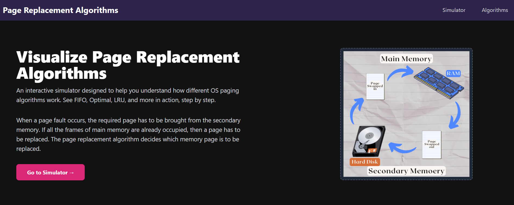
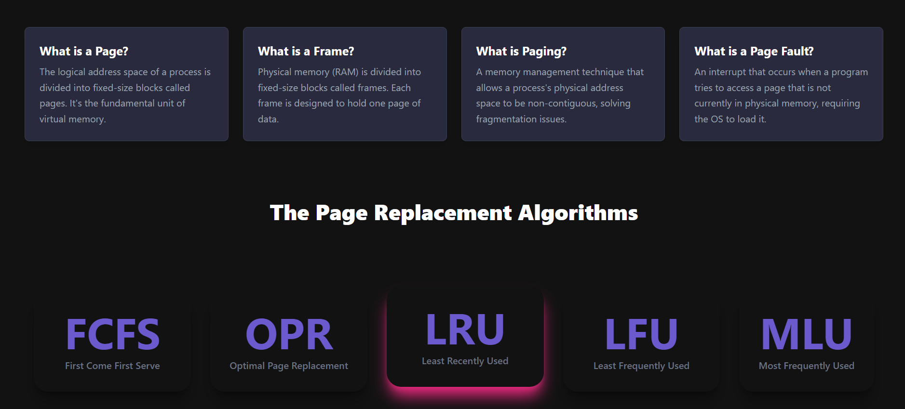
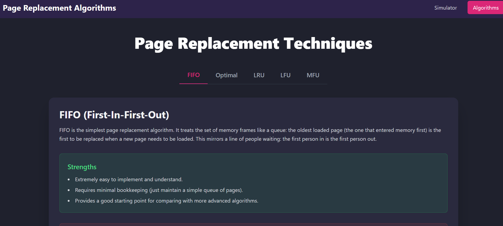
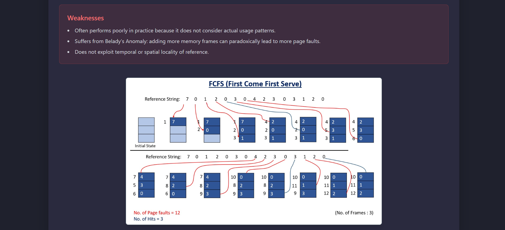
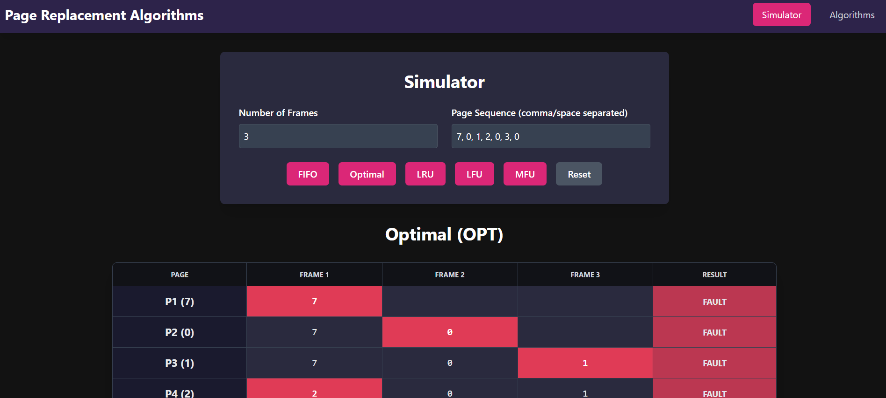
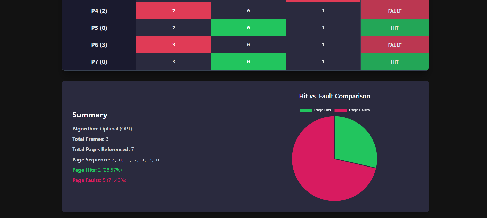

# Page Replacement Algorithm Simulator 🧠

An interactive, high-performance web application designed to help computer science students, educators, and software engineers visualize and understand virtual memory management and page replacement algorithms used in operating systems. 

This tool provides step-by-step simulations, frame snapshot transition matrices, hit/fault ratio analytics, interactive Chart.js visualizations, theoretical documentation, multi-algorithm comparative evaluation, and an embedded C++ reference implementation.

[](https://reactjs.org/)
[](https://vitejs.dev/)
[](https://tailwindcss.com/)
[](https://www.chartjs.org/)
[](LICENSE)

---

## 📸 Screenshots & Previews

<div align="center">
  
  
  <br /><br />
  
  
  <br /><br />
  
  
</div>

---

## ✨ Key Features

* **5 Core Page Replacement Algorithms**: Complete simulations for **FIFO** (First-In, First-Out), **Optimal** (Belady's Min), **LRU** (Least Recently Used), **LFU** (Least Frequently Used), and **MFU** (Most Frequently Used).
* **Interactive Control Panel**: Customizable physical memory frame count (1–10 slider) and page reference sequence input with comma/space sanitization.
* **Quick Presets & Randomizer**: One-click loadable sequence presets (*Standard OS Textbook Example*, *Belady's Anomaly*, *High Locality*) and a 15-page random reference generator.
* **Step-by-Step Frame Matrix**: Real-time memory snapshot table displaying exact frame contents at each page request, with green **Hit** badges and pink/red **Page Fault** eviction highlights.
* **Aggregate Performance Metrics**: Instant calculation of Total Page Requests, Page Hits, Page Faults, Hit Ratio (%), and Fault Ratio (%).
* **Interactive Chart Visualizations**: Responsive Doughnut / Pie charts powered by `react-chartjs-2` for visual hit vs. fault analysis.
* **Multi-Algorithm Comparison Mode**: Side-by-side performance evaluation running all 5 algorithms simultaneously and crowning the optimal policy with a **BEST** trophy badge.
* **Educational Documentation**: Dedicated theory page with algorithm principles, time/space complexity analysis, pros, cons, mathematical formula cards, and step-by-step visual snapshot illustrations.
* **C++ Code Reference**: Integrated C++ source code viewer (`cpp_Implementation.cpp`) with copy-to-clipboard functionality for students studying OS algorithms in C++.
* **Responsive Dark Theme**: Built with modern glassmorphic UI cards, smooth micro-interactions, and fully responsive layouts across mobile, tablet, and desktop viewports.

---

## 🛠️ Tech Stack

* **Frontend Framework**: React 19 + Vite 6 (JavaScript / JSX)
* **Styling**: Tailwind CSS v4 + PostCSS
* **Routing**: React Router DOM (v7)
* **Data Visualization**: Chart.js + `react-chartjs-2`
* **Icons**: `lucide-react`
* **Deployment Config**: Vercel (`vercel.json`)
* **Reference Algorithms**: C++ (`cpp_Implementation.cpp`), JavaScript (`src/algorithms/`)

---

## ⚙️ Getting Started

### Prerequisites
- Node.js (version 18.0 or higher)
- npm (version 9.0 or higher) or yarn

### Local Setup & Installation

1. **Clone the repository**:
   ```bash
   git clone https://github.com/himanshuR239/OS-Page-Simulator.git
   cd OS-Page-Simulator
   ```

2. **Install NPM dependencies**:
   ```bash
   npm install
   ```

3. **Start the local development server**:
   ```bash
   npm run dev
   ```
   Open `http://localhost:5173/` in your browser to view the application live.

4. **Build for production**:
   ```bash
   npm run build
   ```
   The optimized production bundle will be generated in the `/dist` directory.

---

## 📖 How to Use

1. **Navigate to the Simulator Page**: Click on **Simulator** in the navigation bar.
2. **Set Memory Frames**: Drag the range slider or enter a number between 1 and 10.
3. **Input Page Reference String**: Enter page numbers separated by commas or spaces (e.g., `7, 0, 1, 2, 0, 3, 0, 4, 2, 3, 0, 3, 2, 1, 2, 0, 1, 7, 0, 1`) or click a **Quick Preset**.
4. **Select Algorithm**: Choose `FIFO`, `Optimal`, `LRU`, `LFU`, `MFU`, or click **Compare All Algorithms**.
5. **Analyze Results**: Review the step-by-step frame matrix, summary cards, and interactive pie chart.

---

## 📂 Project Structure

```
OS-Page-Simulator/
├── public/                  # Static assets & screenshots
│   ├── logo1.png
│   ├── pageReplacement1.png
│   ├── fifo.jpg, LRU.jpg, OPR.jpg, LFU.jpg, MFU.jpg
│   └── ss1.png - ss6.png
├── src/
│   ├── main.jsx             # React entry point
│   ├── App.jsx              # Main routing & layout component
│   ├── index.css            # Tailwind directives & base styles
│   ├── App.css              # Custom styling
│   ├── algorithms/          # Pure JS algorithm simulation engine
│   │   ├── fifo.js
│   │   ├── lru.js
│   │   ├── optimal.js
│   │   ├── lfu.js
│   │   ├── mfu.js
│   │   └── index.js
│   ├── components/          # Reusable UI components
│   │   ├── Navbar.jsx
│   │   ├── Footer.jsx
│   │   ├── ResultsTable.jsx
│   │   ├── Summary.jsx
│   │   ├── CppCodeViewer.jsx
│   │   └── constants.jsx
│   └── pages/               # Application view routes
│       ├── LandingPage.jsx
│       ├── SimulatorPage.jsx
│       └── AlgorithmsPage.jsx
├── cpp_Implementation.cpp   # Reference C++ source code implementation
├── index.html
├── vite.config.js
├── tailwind.config.js
├── postcss.config.js
├── vercel.json
└── package.json
```

---

## 📄 License

Distributed under the MIT License. See `LICENSE` for more information.
